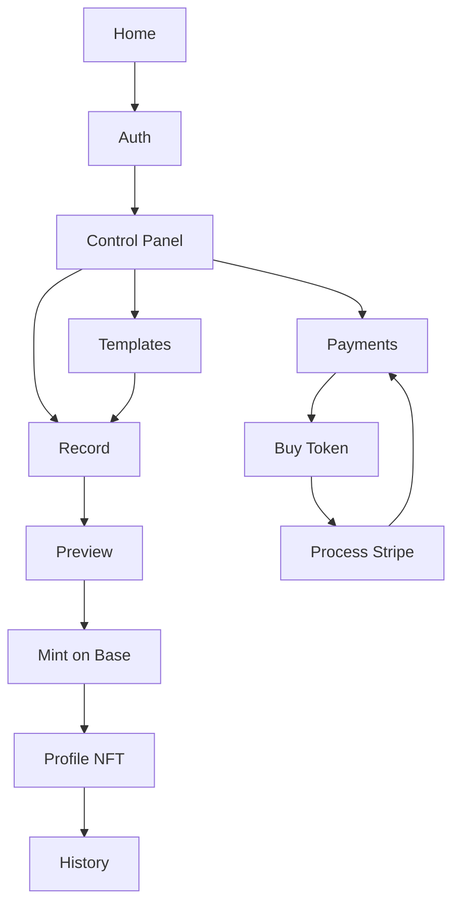

# Legalchain Qwik

Legalchain is a Qwik City workspace for legal evidence operations. The app lets an operator register, authenticate, manage templates, capture or upload evidence, review a draft, mint the final record on Base, and manage token payments from the same private workspace.

## Product Flow



## Main Routes

| Route | Purpose |
| --- | --- |
| `/` | Public home and product overview. |
| `/auth?mode=login` | Sign in flow. |
| `/auth?mode=signup` | Registration flow. |
| `/controlPanel` | Private workspace overview, queue, collection status, template admin. |
| `/templates` | Template library and filtering. |
| `/record` | Capture or upload evidence and save the current draft. |
| `/preview` | Review the current draft and mint the record. |
| `/history` | Archive of minted evidence records. |
| `/profile-nft/[hash]` | Detail page for a published evidence record. |
| `/payments` | Treasury ledger and settlement status. |
| `/buy-token` | Token package selection and checkout creation. |
| `/ProcessStripe` | Stripe or sandbox payment reconciliation. |

## How The App Works

### 1. Registration And Login

- Registration posts to `/api/legalchain/auth/register`.
- The backend creates the Legalchain user in Turso.
- The backend hashes the password and optional PIN.
- The backend generates a custodial wallet for the user and stores the private key encrypted.
- A session cookie is created so the user enters the private workspace immediately.

- Login posts to `/api/legalchain/auth/login`.
- The backend validates email and password first.
- If the user has a PIN configured, the login flow requires the PIN before unlocking the workspace.
- Private routes are protected at the layout level and redirect to `/auth?mode=login` when the session is missing.

### 2. Control Panel

- `Control Panel` is the private landing page after authentication.
- It shows wallet state, collection state, draft state, template counts, review counts, and payment blockers.
- Template management also lives here.
- Templates created from this route are scoped to the current user.

### 3. Templates

- `Templates` is the searchable template library.
- Operators can filter by search term, status, and category.
- Templates provide the script blocks and checkpoints used later by the recording flow.

### 4. Record

- `Record` loads the current user draft and the available templates.
- The operator can capture media or upload an asset manually.
- Assets are uploaded to Storacha.
- The route stores a draft in Turso containing title, template, description, visibility, timestamps, asset URI, and asset HTTP URL.
- This route does not mint yet. It only prepares the next evidence draft.

### 5. Preview

- `Preview` loads the current draft.
- The operator reviews the asset and metadata before publication.
- Minting requires an existing draft and the operator PIN.
- When minting succeeds, the draft is cleared and the user is redirected to the NFT profile route.

### 6. Mint On Base

- Metadata is uploaded to Storacha.
- If the user does not yet have an ERC-721 collection, the app deploys one for that user first.
- The app mints the NFT into the user collection on Base.
- The final record is persisted in Turso with tx hash, token ID, media URL, template info, and metadata.

### 7. History And Profile

- `History` lists the user evidence records already published.
- `Profile NFT` shows the full detail for one minted record, keyed by transaction hash.

### 8. Payments And Treasury

- `Buy Token` creates a backend payment reference for a package.
- If Stripe is configured, the app creates a hosted Stripe checkout session.
- If Stripe is not configured, the app falls back to sandbox mode.
- `ProcessStripe` reconciles the checkout result back into Turso.
- `Payments` shows the ledger and treasury settlement state.
- Once a payment is approved, the backend can transfer ERC-20 tokens and optionally gas from treasury to the user wallet on Base.

## Technical Architecture

### Core Services

- Qwik City for routing, layouts, loaders, and actions.
- Turso for users, sessions, wallets, drafts, templates, records, payments, and transaction logs.
- Storacha for media and metadata storage.
- viem for Base wallet, collection deploy, mint, token transfer, and gas top-up.
- Stripe for hosted checkout.

### Key Data Areas

- `legalchain_users`: operator identity.
- `legalchain_auth`: password hash and salt.
- `legalchain_sessions`: cookie-backed sessions.
- `legalchain_wallets`: encrypted custodial wallets.
- `legalchain_drafts`: current evidence draft per user.
- `legalchain_templates`: recording templates.
- `legalchain_collections`: deployed ERC-721 collection per user.
- `legalchain_records`: published evidence records.
- `legalchain_payments`: token purchase ledger.
- `legalchain_transactions`: on-chain activity log.

## Local Development

### Run

```bash
yarn install
yarn dev
```

Local development starts Qwik City in SSR mode on the default Vite port.

### Verify

```bash
yarn tsc --noEmit
```

### Build

```bash
yarn build
```

## Environment Variables

The checked-in `.env` is now trimmed to the Legalchain surface only. Legacy non-Legalchain variables were intentionally removed from the default setup because they do not belong to the current Legalchain workflow.

### Required For Core App Boot

- `PRIVATE_TURSO_DATABASE_URL`
- `PRIVATE_TURSO_AUTH_TOKEN`

These are the primary database variables used by the Turso client.

### Required For Record And Mint

- `STORACHA_KEY`
- `STORACHA_PROOF`
- `PUBLIC_STORACHA_GATEWAY_HOST`
- `PUBLIC_LEGALCHAIN_CHAIN_ID`
- `PRIVATE_LEGALCHAIN_CHAIN_ID`
- `PRIVATE_LEGALCHAIN_RPC_URL` or `LEGALCHAIN_RPC_URL`

### Required For Custodial Wallet Decryption

- `PRIVATE_LEGALCHAIN_WALLET_SECRET` or `LEGALCHAIN_WALLET_SECRET`

Important:
- The current `.env` sets the same development-safe secret that the app already uses as a fallback in non-production.
- In real environments this should still be replaced with a deliberate secret.
- Changing this value after users already exist can make previously encrypted wallets unreadable.

### Required For Stripe Checkout

- `PRIVATE_STRIPE_SECRET_KEY`
- `PRIVATE_STRIPE_WEBHOOK_SECRET`

Note:
- The current hosted checkout flow does not need a publishable key in this repo.

### Required For Treasury Settlement

- `PRIVATE_LEGALCHAIN_TREASURY_PRIVATE_KEY`
- `PRIVATE_LEGALCHAIN_ERC20_ADDRESS`
- `PRIVATE_LEGALCHAIN_ERC20_DECIMALS`
- `PRIVATE_LEGALCHAIN_GAS_TOPUP_ETH` for an optional override

### Optional For Absolute URLs

- `PUBLIC_APP_URL`
- `PUBLIC_SITE_URL`
- `LEGALCHAIN_APP_URL`
- `ORIGIN`

The current `.env` keeps all three pointed at local development so redirects and webhook fallbacks stay local by default.

### Optional For Local Upload And Fly Deploy

- `UPLOAD_DIR`
- `FLY_APP_NAME`

### Optional For Push Notifications

- `PUBLIC_VAPID_KEY`
- `PRIVATE_VAPID_KEY`

Push subscription UI is mounted in the private layout. If you do not use push delivery, these can be omitted.

## Legacy Env Mapping Applied

The current `.env` was partially aligned with values found in the older `legalchain` repo.

Mapped from the legacy repo:
- Stripe test secret key.
- Base RPC endpoint, derived from the old Alchemy host and API key.
- ERC-20 address used by the older Legalchain config.
- Treasury private key from the legacy backend env.
- Explicit development wallet secret to match the current app fallback behavior.

Intentionally not auto-copied:
- Stripe webhook secret.
- Gas top-up amount.

Reasons:
- The webhook secret does not exist in the legacy repo.
- Gas top-up is business-specific and should not be guessed globally.

Legacy note:
- This repository still contains some non-Legalchain endpoints and services from the older codebase.
- They are intentionally excluded from the default Legalchain `.env` and are not part of the documented Legalchain setup here.

## Security Notes

- Do not commit real secrets to the repository.
- Rotate any legacy secrets that were previously stored in tracked files.
- Treat the treasury private key and wallet encryption secret as high-impact credentials.
